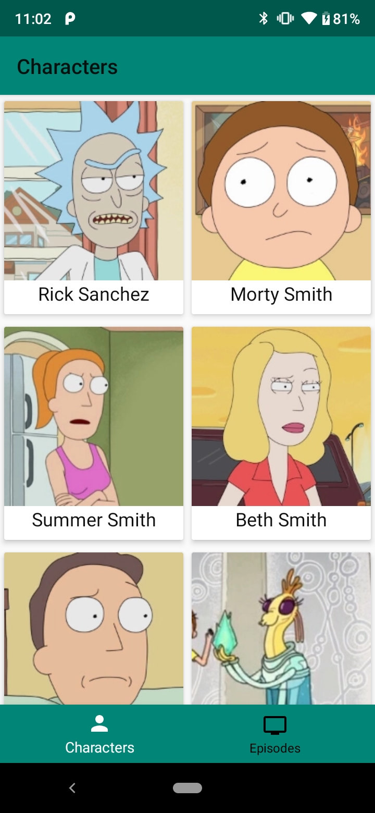
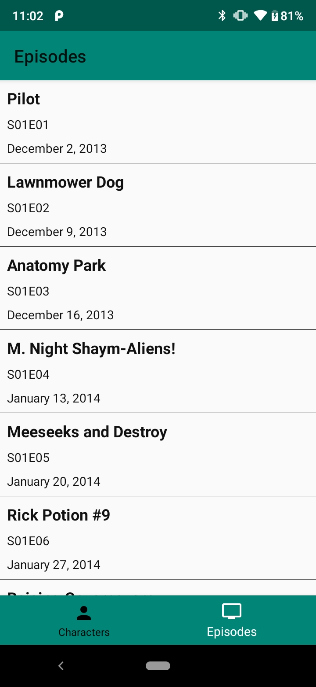
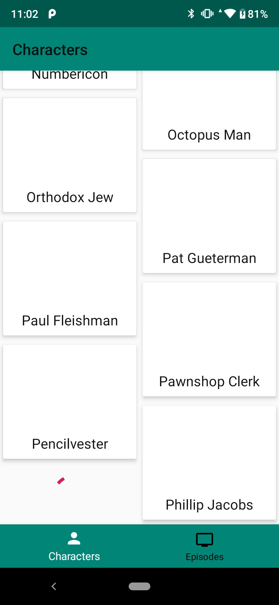
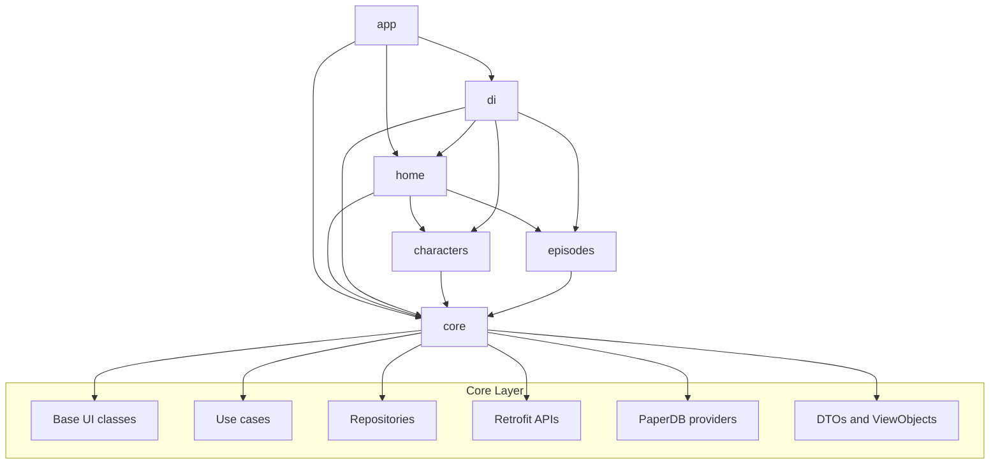
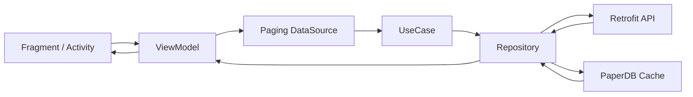

# Rick and Morty Android

[Português (Brasil)](./README.pt-BR.md) | **English**

A modular Android application built with Kotlin that consumes the Rick and Morty API and showcases a production-oriented architecture with MVVM, repository abstraction, dependency injection, pagination, and local caching.

This project was designed as a clean portfolio sample focused on code organization, maintainability, and scalability.
It also documents a practical vibe-coding pass where documentation polish and code quality improvements evolved together.

## Demo

  
  
  

  Preview of the main browsing flows available in the current build.

## Overview

The app delivers a simple browsing experience for Rick and Morty content through feature modules and a shared core layer.

### Main highlights

- Modularized multi-module Android project
- MVVM presentation layer with clear separation of responsibilities
- Repository pattern coordinating remote and local data sources
- RxJava-based asynchronous flows
- Paging integration for large API lists
- Dagger 2 dependency injection across modules
- Retrofit + Moshi for networking and serialization
- PaperDB-based local fallback cache
- View Binding and Navigation Component integration
- Java 17 toolchain and modern Android Gradle setup

## Architecture

The codebase is organized around feature modules and a reusable core layer. Navigation starts in the `app` module, the `home` module coordinates the main shell and bottom navigation, and each feature owns its presentation flow.

### Data flow

### Module structure

- `app`: Application entry point, manifest merge, and top-level Android configuration.
- `core`: Shared domain, data, UI base classes, utilities, DTOs, Retrofit services, repositories, and cache providers.
- `di`: Dagger setup, application graph, modules, and ViewModel factory wiring.
- `home`: Main host activity, toolbar, bottom navigation, and navigation graph integration.
- `characters`: Characters feature UI, paging datasource, adapter, and ViewModel.
- `episodes`: Episodes feature UI, paging datasource, adapter, and ViewModel.
- `buildSrc`: Centralized dependency and Android configuration management.

## Tech stack

- Kotlin
- Android Gradle Plugin 9.1.0
- Android View Binding
- MVVM
- Repository Pattern
- Dagger 2
- RxJava 2 / RxAndroid 2
- Retrofit 2
- Moshi
- OkHttp
- AndroidX Navigation Component
- AndroidX Paging
- Glide
- PaperDB
- JUnit and Mockito

## Modernization and quality improvements

This repository now documents and reflects a modernization pass aimed at removing legacy rough edges and making the project presentation consistent with the codebase quality.

- Reworked the README into a recruiter-friendly portfolio presentation
- Added bilingual documentation in English and Brazilian Portuguese
- Fixed broken image references by pointing the README to local `design` assets
- Added architecture and data-flow diagrams to explain the modular structure quickly
- Documented the project as an intentional vibe-coding modernization pass
- Highlighted the current Android stack already in use: Java 17, Kotlin 2.2.10, AGP 9.1.0, compileSdk 36, targetSdk 36, and AndroidX Navigation 2.9.7
- Replaced fragment `ViewBinding` patterns that could retain the view after `onDestroyView`
- Prevented fragile adapter click handling that depended on `adapterPosition` and nullable items
- Improved paged footer state updates to avoid broad `notifyDataSetChanged()` refreshes
- Centralized Rx cleanup in `BaseViewModel` so disposal is consistent across screens
- Replaced placeholder core unit tests with real DTO-to-domain mapping tests

## Test coverage

- Current aggregated line coverage: `19.31%`
- Coverage is measured with JaCoCo using the repository task `./gradlew clean jacocoRepoReport`
- HTML report output: `RickandMorty/build/reports/jacoco/jacocoRepoReport/html/index.html`
- XML report output: `RickandMorty/build/reports/jacoco/jacocoRepoReport/jacocoRepoReport.xml`

## Change log for this cleanup

- Portfolio-oriented README rewrite in English
- PT-BR README added with cross-links between both versions
- Visual badges for stack, architecture, modules, and modernization status
- Demo section using real app screens from `design/`
- Architecture and data-flow diagrams in Mermaid
- Explicit vibe-coding note for the modernization and cleanup pass
- Documentation of module responsibilities and technical stack
- Code quality fixes for fragments, adapters, and ViewModel disposal
- Real unit test coverage added for domain mapping flows

## Why this project stands out

This repository is intentionally structured to demonstrate how an Android app can scale beyond a single-module codebase. The focus is not only on fetching API data, but on presenting:

- reusable architecture boundaries
- feature isolation
- dependency graph organization
- fallback caching strategy
- recruiter-friendly code readability

## Getting started

### Requirements

- Android Studio with Gradle support
- JDK 17
- Android SDK configured locally

### Run locally

1. Clone the repository.
2. Open the project root in Android Studio.
3. Sync Gradle dependencies.
4. Run the `app` configuration on an emulator or device.

## Notes

- The app currently focuses on the `characters` and `episodes` flows.
- Project configuration is centralized in `buildSrc`.
- The repository includes modular boundaries that make future expansion straightforward.

## Author

**Renato Ramos**

## License

This project is licensed under the MIT License. See [LICENSE](./LICENSE) for details.
