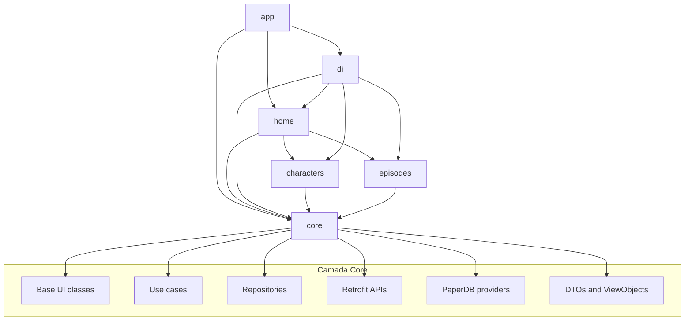
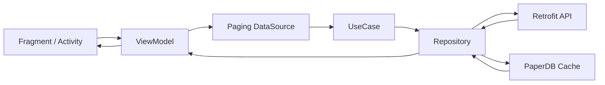

# Rick and Morty Android

**Português (Brasil)** | [English](./README.md)

Aplicativo Android modularizado em Kotlin que consome a API de Rick and Morty e demonstra uma arquitetura orientada a produção com MVVM, repositórios, injeção de dependência, paginação e cache local.

Este projeto foi pensado como uma vitrine técnica para portfólio, com foco em organização de código, escalabilidade e manutenção.
Ele também registra uma sessão prática de vibe coding, em que evolução visual da documentação e melhorias reais de qualidade caminharam juntas.

## Demo

  
  
  

  Prévia dos principais fluxos disponíveis na versão atual do app.

## Visão geral

O app entrega uma experiência de navegação simples pelo universo de Rick and Morty usando módulos de feature e uma camada compartilhada de core.

### Principais destaques

- Projeto Android modularizado em múltiplos módulos
- Camada de apresentação em MVVM com separação clara de responsabilidades
- Repository Pattern coordenando fontes de dados remotas e locais
- Fluxos assíncronos com RxJava
- Integração com Paging para listas grandes da API
- Injeção de dependência com Dagger 2 entre os módulos
- Retrofit + Moshi para rede e serialização
- Cache local com fallback usando PaperDB
- Integração com View Binding e Navigation Component
- Toolchain em Java 17 e setup moderno com Android Gradle

## Arquitetura

O código foi organizado em módulos de feature e uma camada `core` reutilizável. A navegação começa no módulo `app`, o módulo `home` coordena o shell principal e a bottom navigation, e cada feature é responsável pelo seu próprio fluxo de apresentação.

### Fluxo de dados

### Estrutura dos módulos

- `app`: ponto de entrada da aplicação, merge de manifestos e configuração Android de topo.
- `core`: domínio compartilhado, camada de dados, classes base de UI, utilitários, DTOs, serviços Retrofit, repositórios e providers de cache.
- `di`: configuração do Dagger, grafo da aplicação, módulos de injeção e fábrica de ViewModels.
- `home`: activity principal, toolbar, bottom navigation e integração do grafo de navegação.
- `characters`: UI da feature de personagens, datasource de paginação, adapter e ViewModel.
- `episodes`: UI da feature de episódios, datasource de paginação, adapter e ViewModel.
- `buildSrc`: centralização de dependências e configurações Android.

## Stack técnica

- Kotlin
- Android Gradle Plugin 9.1.0
- Android View Binding
- MVVM
- Repository Pattern
- Dagger 2
- RxJava 2 / RxAndroid 2
- Retrofit 2
- Moshi
- OkHttp
- AndroidX Navigation Component
- AndroidX Paging
- Glide
- PaperDB
- JUnit e Mockito

## Modernização e melhorias de qualidade

Este repositório agora documenta e reflete uma passada de modernização pensada para remover pontos defasados e alinhar a apresentação do projeto com a qualidade real do código.

- Reescrita do README com posicionamento mais forte de portfólio
- Documentação bilíngue em inglês e português do Brasil
- Correção das imagens quebradas com uso dos assets locais da pasta `design`
- Inclusão de diagramas de arquitetura e fluxo de dados para explicar a estrutura modular rapidamente
- Registro do projeto como uma modernização intencional conduzida em vibe coding
- Destaque da stack Android atual já presente no projeto: Java 17, Kotlin 2.2.10, AGP 9.1.0, compileSdk 36, targetSdk 36 e AndroidX Navigation 2.9.7
- Ajuste do padrão de `ViewBinding` nos fragments para evitar retenção de view após `onDestroyView`
- Correção de cliques frágeis nos adapters paginados que dependiam de `adapterPosition` e itens nulos
- Melhoria na atualização do footer paginado para evitar refresh amplo com `notifyDataSetChanged()`
- Centralização do cleanup de Rx no `BaseViewModel`, garantindo descarte consistente entre telas
- Substituição do teste placeholder do `core` por testes reais de mapeamento entre DTOs e view objects

## Cobertura de testes

- Cobertura agregada atual de linhas: `19.31%`
- A cobertura é medida com JaCoCo usando a task `./gradlew clean jacocoRepoReport`
- Relatório HTML: `RickandMorty/build/reports/jacoco/jacocoRepoReport/html/index.html`
- Relatório XML: `RickandMorty/build/reports/jacoco/jacocoRepoReport/jacocoRepoReport.xml`

## Lista de mudanças desta limpeza

- Reescrita do README principal com foco em portfólio
- Adição do `README.pt-BR.md` com links entre as duas versões
- Inclusão de badges visuais para stack, arquitetura, módulos e status de modernização
- Seção de demo usando telas reais do app na pasta `design/`
- Diagramas Mermaid de arquitetura e fluxo de dados
- Menção explícita à sessão de vibe coding desta modernização
- Documentação das responsabilidades de módulos e stack técnica
- Correções de qualidade em fragments, adapters e descarte de recursos nos ViewModels
- Cobertura de testes reais para os fluxos de mapeamento da camada de domínio

## Por que este projeto chama atenção

Este repositório foi estruturado para demonstrar como um app Android pode evoluir além de uma base monolítica. O foco não é apenas consumir uma API, mas também evidenciar:

- limites arquiteturais reutilizáveis
- isolamento de features
- organização do grafo de dependências
- estratégia de fallback com cache local
- legibilidade de código para avaliação técnica

## Como executar

### Requisitos

- Android Studio com suporte a Gradle
- JDK 17
- Android SDK configurado localmente

### Rodando localmente

1. Clone o repositório.
2. Abra a raiz do projeto no Android Studio.
3. Faça o sync das dependências Gradle.
4. Execute a configuração `app` em um emulador ou dispositivo.

## Observações

- O app atualmente está focado nos fluxos de `characters` e `episodes`.
- A configuração do projeto está centralizada em `buildSrc`.
- A separação em módulos facilita a expansão futura da aplicação.

## Autor

**Renato Ramos**

## Licença

Este projeto está licenciado sob a MIT License. Veja [LICENSE](./LICENSE) para mais detalhes.
